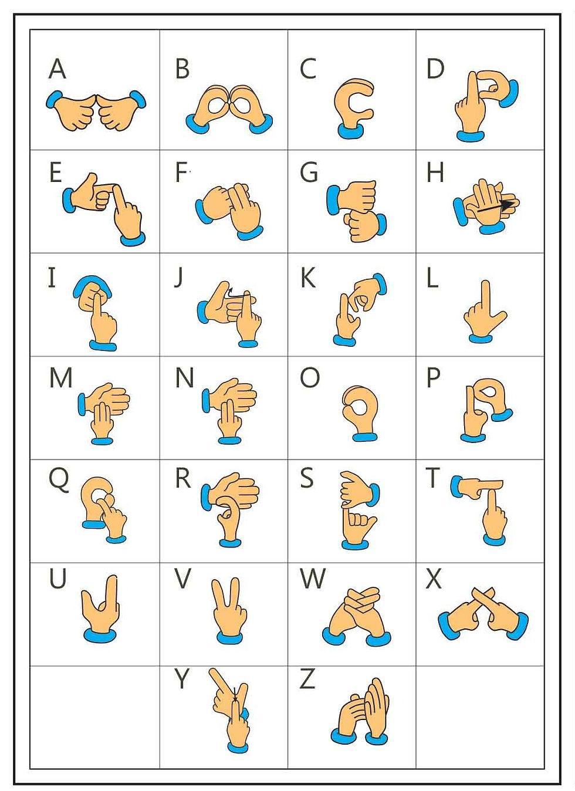

# NeuroSign 🤟

An AI-based system that converts sign language gestures into text (and speech) using computer vision and machine learning.

## 🌟 Features

- **Real-time gesture recognition** via webcam input
- **Keypoint-based classification** — hand landmarks are extracted and classified using a trained model
- **Text-to-speech output** — recognized signs are converted to spoken audio
- **Gesture history tracking**
- **Responsive demo web interface** showcasing the recognition pipeline: Input → Preprocessing → Feature Extraction → Classification → Text Output → Speech Output

## 🔤 Dataset — Indian Sign Language (ISL)

NeuroSign recognizes the **Indian Sign Language (ISL) alphabet** (A–Z), where each letter is represented by a distinct static hand pose (with a couple of letters like H, J, and Z involving a small motion). The chart below is the reference used for building the dataset:



Since ISL letters differ from ASL in several shapes (e.g. many ISL letters are formed using **two hands**, unlike ASL's one-handed alphabet), a custom dataset was created rather than reusing an existing ASL dataset.

### How the dataset was built

The model doesn't classify raw images — it classifies **hand landmark keypoints** extracted by [MediaPipe Hands](https://developers.google.com/mediapipe/solutions/vision/hand_landmarker), which is lighter, faster, and more robust to background/lighting than raw image classification.

**Pipeline (as implemented in `backend/app.py`):**
1. **Capture landmarks, not pixels** — For each webcam frame, MediaPipe Hands detects 21 keypoints per hand. If only one hand is visible, the second hand's slot is padded with zeros — so every sample is always a fixed-length **84-value vector** (42 values per hand × 2 hands).
2. **Normalize** — Each hand's landmarks are shifted so the wrist (landmark 0) becomes the origin, then flattened and scaled by the largest absolute coordinate. This makes the vector independent of where the hand is in the frame or how big it appears.
3. **Log a new class interactively** — While `app.py` is running:
   - Press **`K`** to enter logging mode. The terminal prompts you to type a class name (e.g. `A`, `B`, `HELLO`) and press **Enter** — this registers a new label (or reuses an existing one) in `keypoint_classifier_label.csv`.
   - Press **`S`** to save the current frame's landmark vector into `keypoint.csv`, tagged with whichever class is currently active.
   - Press **`N`** to return to normal inference mode (no more logging).
   - Press **`ESC`** to quit.
4. **Repeat per class** — Do this for every letter/gesture, capturing many samples (ideally 100s per class, varied angle/lighting/hand size) to build a balanced dataset in `keypoint.csv`.
5. **Retrain** — Run `keypoint_classification.ipynb` to train a classifier on the collected `keypoint.csv`, producing the `.hdf5` (full Keras model) and `.tflite` (compressed, used at runtime) files in `model/keypoint_classifier/`.
6. **Point-history model (for motion letters)** — For dynamic gestures, `point_history_classifier` tracks a fingertip's position across the last 16 frames (triggered when the static classifier predicts a specific "tracking" class) and classifies that motion trajectory using a second, separately trained model in `model/point_history_classifier/`.

### 🧑‍🏫 How to create your own dataset (e.g. to add new signs or a different gesture set)

1. **Run `backend/app.py`** with your webcam connected.
2. **Press `K`** to enter logging mode, then type the class name in the terminal (e.g. a new letter or word) and hit **Enter**. This adds it to `keypoint_classifier_label.csv` if it's new.
3. **Show the hand gesture** clearly to the camera and **press `S`** repeatedly (or hold, depending on your loop) to save several landmark samples for that class into `keypoint.csv`. Aim for a few hundred samples per class, varying hand angle, distance, and lighting.
4. **Press `N`** to exit logging mode, then **`K`** again to start logging the next class — repeat for every gesture you want to add.
5. **Press `ESC`** when you're done collecting data.
6. **Retrain the model** by running `keypoint_classification.ipynb` — it reads the updated `keypoint.csv` and `keypoint_classifier_label.csv`, trains the classifier, and exports fresh `.hdf5`/`.tflite` files.
7. **Restart `app.py`** — it will now recognize your new/updated gesture set.
8. **(Optional) For motion-based gestures**, follow the equivalent process using the point-history logging path and retrain via a similar notebook for `point_history_classifier`.

This landmark-based approach means adding a new sign doesn't require retraining a full image-based deep learning model — you just collect more labeled landmark rows and retrain the lightweight classifier.

## 🎯 Applications

- Communication aid for the deaf/hard-of-hearing community
- Educational learning tool for sign language
- Human-computer interaction and accessibility technology

## 🛠️ Tech Stack

**Backend**
- Python, Flask/FastAPI-style `app.py` server
- Keypoint & point-history classification models (trained via Jupyter notebooks)
- Separate `requirements_train.txt` and `requirements_run.txt` for training vs. inference environments

**Frontend**
- HTML, CSS, JavaScript
- Web Speech API for text-to-speech

## 📂 Structure

```
NeuroSign/
├── backend/     # Model, inference server, training notebooks
└── frontend/    # Demo web interface
```

## 🚀 Getting Started

**Backend:**
```bash
cd backend
pip install -r requirements_run.txt
python app.py
```

**Frontend:**
Open `frontend/index.html` in a browser (see `frontend/INTEGRATION_GUIDE.md` for connecting it to the backend).

## 📌 Notes

This was built as a mini-project demonstrating an end-to-end gesture-recognition pipeline. See `frontend/DEMO_GUIDE.md` for a walkthrough of the live demo.
